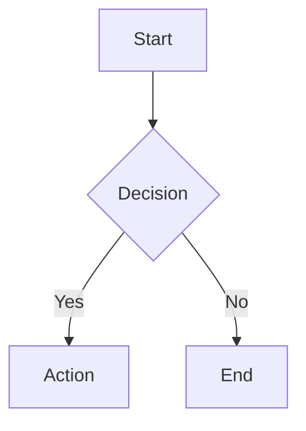
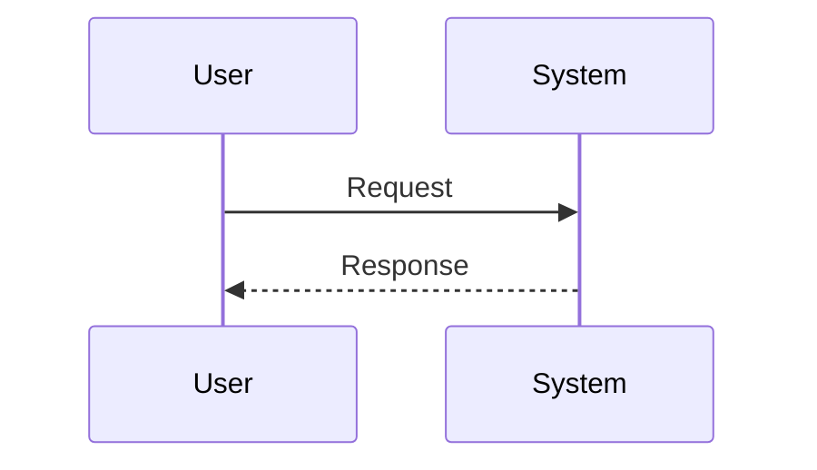
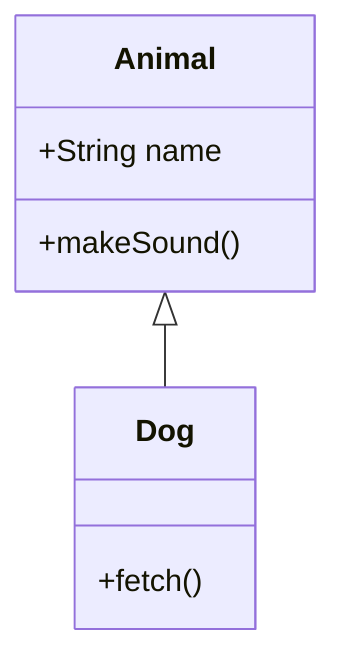
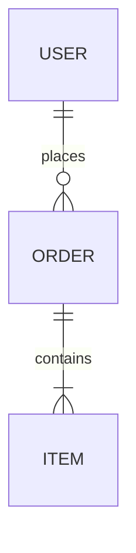
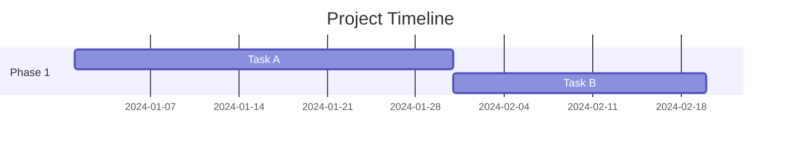
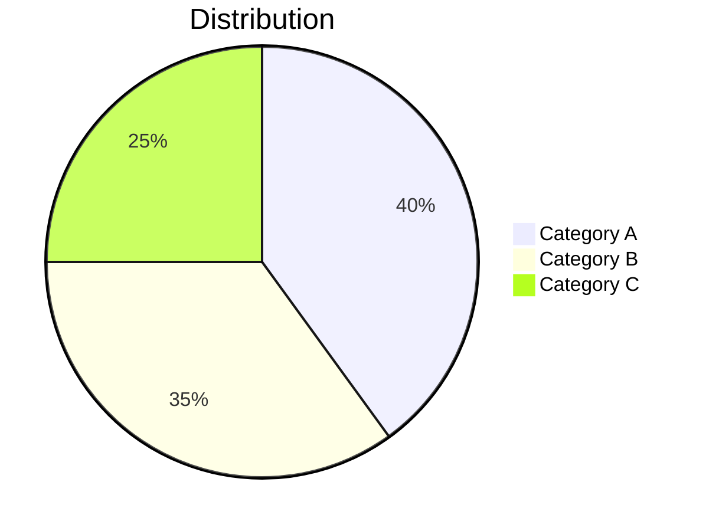
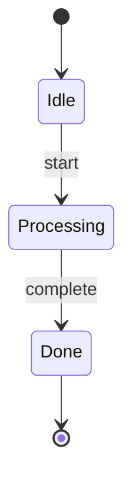
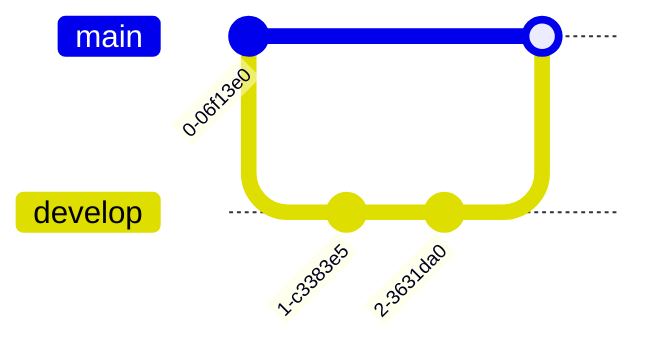
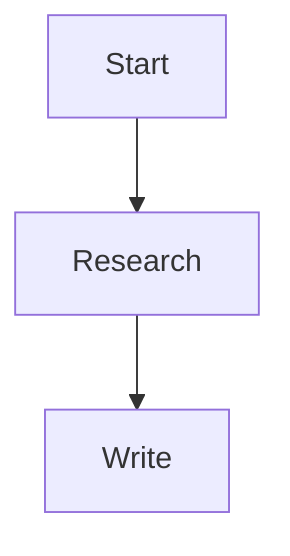

# Mermaid Diagrams in Obsidian

Mermaid is a **core Obsidian plugin** -- always available. No installation needed.

## Syntax

````markdown
```mermaid
diagramType
  content
```
````

## Diagram Types

### Flowchart



### Sequence Diagram



### Class Diagram



### ER Diagram



### Gantt Chart



### Pie Chart



### State Diagram



### Git Graph



## Obsidian-Specific: Linking to Notes

Use `class` to make Mermaid nodes link to Obsidian notes:



Or link specific nodes to specific notes:

```mermaid
graph TD
    A[Project Plan] --> B[Tasks]
    classDef link class internal-link;
    class A link;
    class B link;
```

## Configuration

Add a `%%` config block at the top:


Available themes: `default`, `forest`, `dark`, `neutral`, `base`

## Best Practices

1. Keep diagrams focused -- one concept per diagram
2. Use meaningful node labels
3. Use `%%` for comments within diagrams
4. Avoid special characters `{}` in labels without quotes
5. For large diagrams, use `flowchart` over `graph` (better layout)
